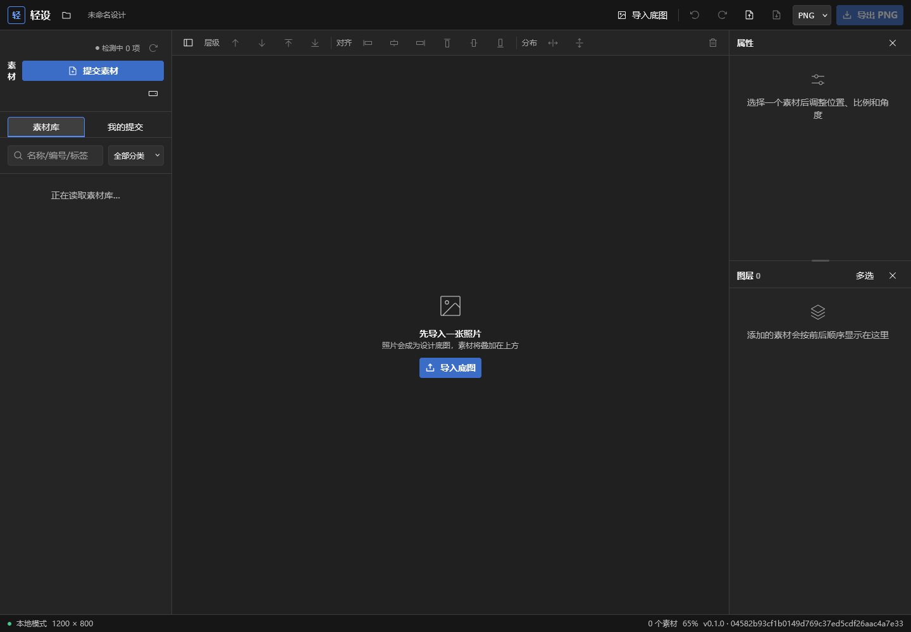
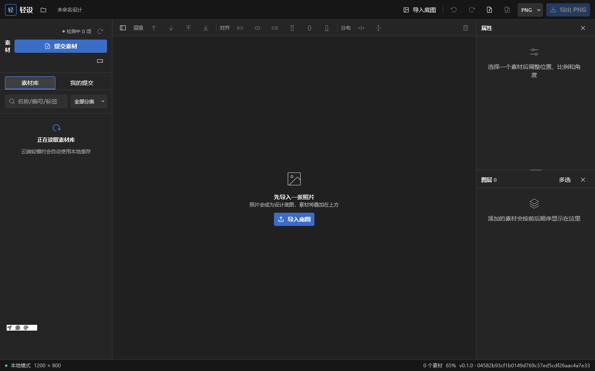
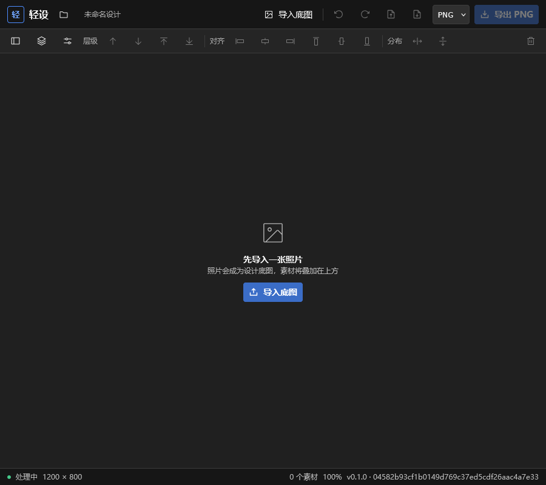
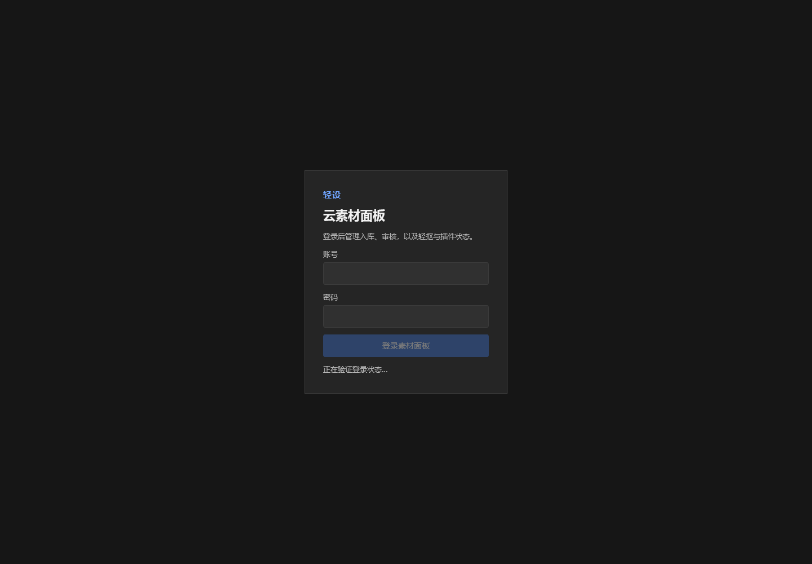

# 轻设全力优化验收报告（2026-07-21）

## 结论

| 维度 | 状态 | 验收结果 |
| --- | --- | --- |
| 素材面板体验 | ✅ | 加载、空结果、搜索清除与触控反馈更明确 |
| 云素材稳定性 | ✅ | 缓存异常不再拖垮在线结果；陈旧请求不再覆盖新查询 |
| 投稿状态同步 | ✅ | 6 路有界并发、防重叠轮询、错误恢复与终态令牌擦除 |
| 编辑器可达性 | ✅ | 700–1179px 键鼠入口恢复；触控目标 44px；语义属性修正 |
| 项目数据安全 | ✅ | 恢复失败后暂停自动保存，避免覆盖原项目 |
| 崩溃恢复 | ✅ | App、素材管理、处理端、产品页和说明书均有重新载入兜底 |
| Windows 交付 | ✅ | Release EXE 与 NSIS 安装包构建成功，新版 App 已启动 |

## 视觉证据

### 优化前：素材区只有单行等待文本

### 优化后：明确加载状态与缓存降级说明

### 900px 键鼠布局：素材、图层、属性入口均可见

### 素材管理台登录态

## 验证证据

- TypeScript 全仓类型检查：通过。
- 变更相关 Vitest：16/16 通过；最终竞态修复复测 7/7 通过。
- 变更文件 Biome：通过。
- `pnpm build:all`：App、素材管理台、处理端、浏览器扩展与产品边界全部通过。
- Windows `release` 构建：通过；生成 `qingshe-desktop.exe` 与 `轻设_0.1.0_x64-setup.exe`。
- Firefox：1440×900 桌面态与 900×800 键鼠态完成当前版本截图复核。

## 说明

本轮视觉证据聚焦可稳定复现的首屏、加载态与中等宽度入口；截图不替代自动化功能测试。全仓 `pnpm check` 在当前 Windows 检出中会把既有 CRLF 换行当作格式差异，因此本轮以变更文件定向检查和远端 CI 的干净检出为准，未批量改写无关文件。
