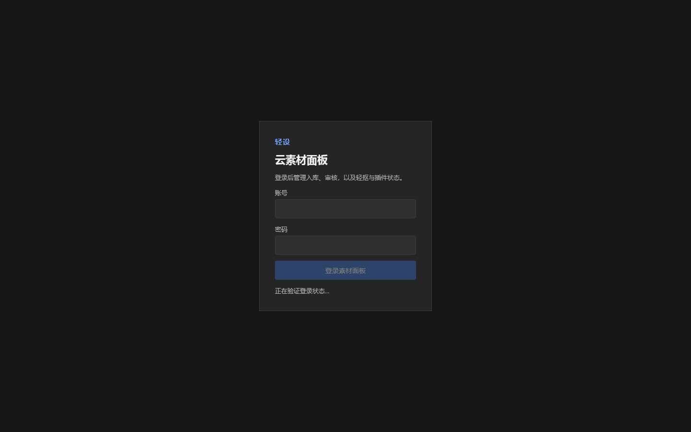

# 轻设云服务器与 App 优化验收报告

日期：2026-07-22
版本：`518223c feat: harden cloud deploys and offline caching`

## 总体状态

| 验收面 | 状态 | 核心证据 |
| --- | --- | --- |
| App 请求与离线缓存 | 通过 | Vitest 66 个文件；250 项通过、4 项跳过 |
| App 类型与构建 | 通过 | `pnpm typecheck`、`pnpm build:all`、Windows Release/NSIS 构建通过 |
| 云端任务一致性 | 通过 | 云端相关测试 59 项通过；任务租约、完成 outbox、崩溃恢复均有覆盖 |
| 无中断部署 | 通过 | 主实例/Canary 分阶段切换；120 次连续公网探测全部 2xx、0 次 5xx |
| 线上运行 | 通过 | 主容器 healthy；0 restart；未发生 OOM；Canary 正常退出 |
| App 与浏览器启动 | 通过 | `qingshe-desktop` 窗口可响应；Firefox 云素材面板可响应 |
| 全仓格式检查 | 有已知噪声 | Windows checkout 中 148 个既有 CRLF 格式项；本次变更定向 Biome 与 `git diff --check` 通过 |

## 优化链路

| 层级 | 改动 | 用户价值 |
| --- | --- | --- |
| 客户端 | 请求 Abort、目录短重试、健康状态防抖、隐藏页暂停轮询 | 减少瞬时抖动、过期请求和后台无效流量 |
| 本地缓存 | 版本单调更新、事务化写入、主备文件恢复、pin 迁移 | 断网时仍可使用，旧响应不会覆盖新素材 |
| 云端 API | `/health` 与 `/ready` 分离、任务租约和 owner fencing | 部署/维护期间状态更准确，旧工作节点不能覆盖新结果 |
| 数据一致性 | 处理完成 outbox、SQLite 原子认领、启动时对账 | 云端重启或进程崩溃后可恢复完成状态 |
| 部署 | 唯一镜像标签、Canary 预热、Caddy 平滑 reload、自动回滚 | 服务器更新期间避免单实例重建造成的 502 |

## 分步验收

1. **基线诊断 — 通过**
   历史 502 与单实例 Compose 重建时间窗口一致；未发现 OOM、磁盘耗尽或应用崩溃证据。

2. **App 功能与缓存 — 通过**
   完成请求生命周期、云目录读取、后台轮询、浏览器/原生缓存并发与恢复优化。

3. **云端任务与控制面 — 通过**
   完成跨进程锁、任务租约、处理完成 outbox、重复提交恢复和 owner fencing。

4. **分阶段部署 — 通过**
   Canary 健康后才切换流量；Caddy 配置先校验再平滑加载；失败路径可回滚旧镜像。

5. **公网连续监测 — 通过**
   120/120 次请求返回 2xx；5xx 为 0；本轮最大延迟 1540 ms。

6. **桌面端与 Firefox 联调 — 通过**
   桌面端窗口 `轻设` 正常响应；Firefox 窗口 `轻设 · 云素材面板` 正常响应。

## 云素材面板验收截图

## 截图验收边界

Windows Graphics Capture 在当前桌面会话中被系统拒绝，因此无法自动截取原生 Tauri 窗口。桌面端以 Release 构建、进程响应状态和同源 Firefox 页面验证；两张仅停留在异步加载状态的候选图未纳入验收证据。

## 结论

本轮已把高频掉线的主要根因从“单实例重建时连接被拒绝”改为 Canary 预热和平滑切换，并补齐 App 的瞬时网络失败容错、离线缓存一致性和云端处理崩溃恢复。当前版本可继续用于本地、桌面端和云端联调。
