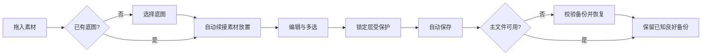
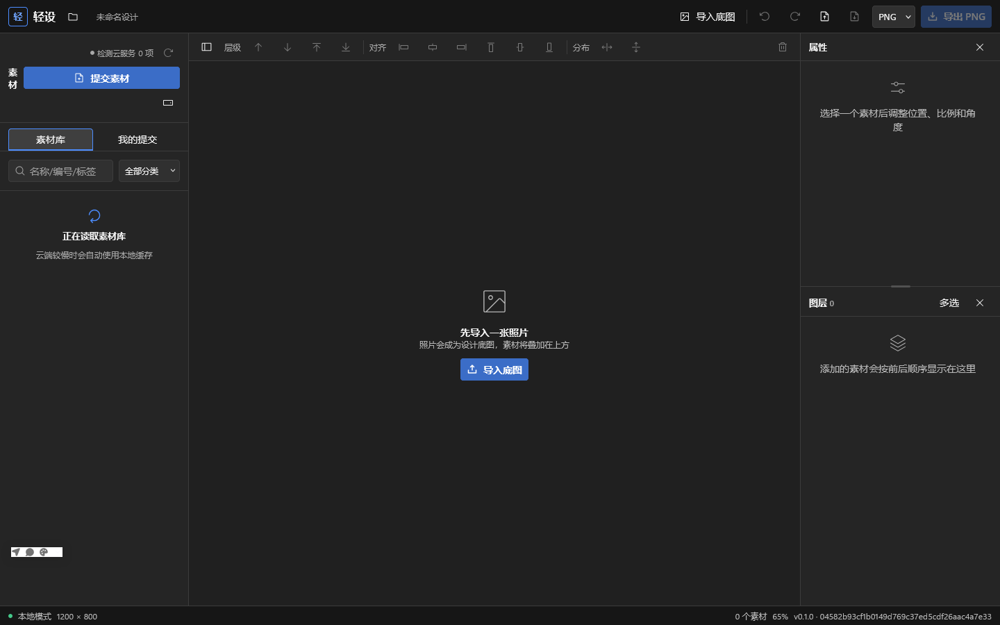

# 轻设 App 功能优化验收

日期：2026-07-22

## 用户主流程

## 验收矩阵

| 步骤 | 场景 | 健康度 | 验收证据 |
| --- | --- | --- | --- |
| 1 | 编辑器空白项目与底图入口 | 通过 | Firefox 当前运行截图 |
| 2 | 空画布拖素材后导入底图 | 通过 | 单元测试验证导入成功后自动放置；失败不误放 |
| 3 | 锁定/隐藏层与多选操作 | 通过 | 删除、移动、层级、变换、微调、Pinch 精准测试 |
| 4 | 桌面项目损坏恢复 | 通过 | 主损坏/备份有效、双损坏、修复写失败、备份保留测试 |
| 5 | 素材投稿 | 通过 | 8 秒凭证超时、独立取消、并发取消隔离与 UI 取消测试 |
| 6 | 全量回归 | 通过 | 63 个测试文件；222 通过，4 条条件跳过 |

## 当前运行截图

### 优化前基线

### 优化后本地 Firefox

截图只能证明当前可见布局和首屏状态；锁定层保护、取消竞态与备份恢复属于行为和故障路径，验收依据以自动化测试及桌面构建结果为主。
